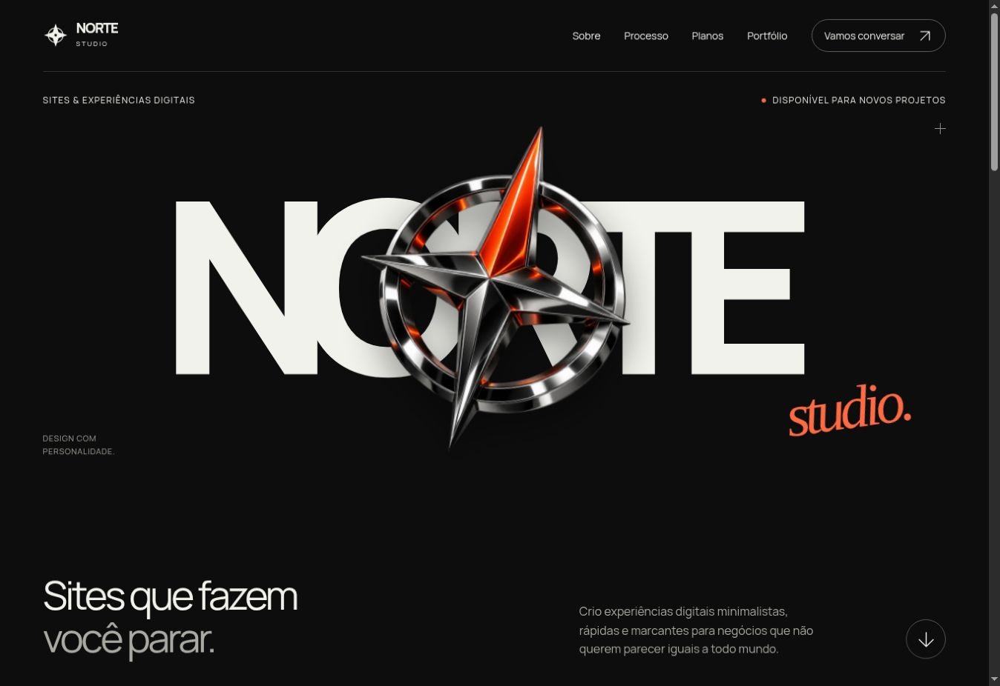

# Revisão técnica — Norte Studio

Data: 23/09/2026. Base inspecionada: repositório `kakazzq1/norte-websites`, commit `98f89e5`. O repositório de origem não recebeu alterações ou commits nesta entrega.

## Implementação

O novo design desta conversa foi adaptado para fundo escuro, com preto, cinza e laranja avermelhado. Foram mantidos a marca NORTE em destaque, a bússola, as seções de apresentação, processo, planos e contato. Os planos exibem R$ 490, R$ 990 e “Sob consulta”. O portfólio preserva o conteúdo existente, sem projetos inventados.

O CSS, JavaScript, fontes e imagens foram separados do HTML. As páginas públicas usam o mesmo cabeçalho, menu para celular, rodapé e linguagem visual. As imagens antigas foram preservadas no pacote; recursos sem uso não são carregados pelas páginas.

A bússola mantém movimento contínuo suave por CSS. Há entrada de texto, revelação de seções ao rolar, faixa animada e loading inicial breve. O loading termina por CSS e não intercepta cliques. A preferência `prefers-reduced-motion` desativa os movimentos; as animações principais são pausadas quando a aba fica oculta. Não há parallax seguindo o mouse nem biblioteca de animação externa.

## Rotas e SEO

| Rota | Tratamento |
| --- | --- |
| `/` | Inicial, canonical e sitemap |
| `/orcamento/` | Orçamento padrão, canonical e sitemap |
| `/orcamento-personalizado/` | Orçamento personalizado, canonical e sitemap |
| `/portfolio/` | Conteúdo existente, canonical e sitemap |
| `/orcamento-personalizado.html` | Redireciona para a rota atual, preserva query/hash, `noindex` e fora do sitemap |
| `/painel/` | Painel original, `noindex`, bloqueado no robots e fora do sitemap |

As quatro páginas públicas têm título, descrição, canonical, Open Graph básico, idioma pt-BR, viewport, favicon, um H1 por página e headings hierárquicos. A imagem possui texto alternativo e o compartilhamento usa um asset local existente no pacote. O `sitemap.xml` contém somente as quatro rotas públicas acima no domínio solicitado. O XML foi validado. O `robots.txt` aponta para esse sitemap.

## Integração preservada

Ambos os formulários mantêm o projeto Supabase existente e enviam POST para `/rest/v1/orcamentos`, com os mesmos oito campos:

| Campo no banco | Orçamento padrão | Orçamento personalizado |
| --- | --- | --- |
| `nome` | Nome | Nome |
| `whatsapp` | WhatsApp | WhatsApp |
| `email ou instagram` | Contato informado | E-mail e Instagram, como no projeto original |
| `tipo_site` | Tipo de projeto | Tipo de projeto |
| `estilo` | Direção visual | Quantidade de páginas, conforme o contrato original |
| `orcamento` | Faixa de investimento | Faixa de investimento |
| `prazo` | Prazo | Prazo |
| `descricao` | Descrição | Empresa, recursos, serviços e detalhes reunidos no formato original |

Nomes de campos, opções, valores de seleção e etapas foram comparados com o projeto de origem. A mudança de `text` para `tel` no WhatsApp melhora o teclado no celular. Foram acrescentados limites de tamanho, remoção de espaços nas extremidades, verificação de WhatsApp com DDD, validação de e-mail quando exigido e bloqueio de envio enquanto uma solicitação está em andamento. Falhas preservam os dados; timeouts informam que o resultado não pôde ser confirmado.

Foi corrigido apenas o uso da chave pública no envio: a chave `sb_publishable_…` permanece no cabeçalho `apikey`, sem ser enviada como um falso token Bearer. O painel continua usando o token de sessão do usuário autenticado como antes. Referência técnica: https://supabase.com/docs/guides/getting-started/api-keys

O HTML e o JavaScript do painel foram preservados byte a byte. Seu CSS recebeu somente a paleta escura, sem mudanças na autenticação ou no comportamento. Seu SQL e instruções foram copiados para `referencia-backend/`, fora da pasta pública. Nenhuma instrução SQL foi executada.

## Atualização do modo escuro

A mudança de tema alterou somente cores de CSS, a cor do navegador, o miolo do ícone vetorial e o favicon. Foram preservados conteúdo, preços, estrutura, medidas, animações, JavaScript, integrações, sitemap e robots. Os testes de envio abaixo pertencem à revisão anterior, com os mesmos scripts. Não foram repetidos envios ao trocar as cores. Nesta atualização foram conferidos o início, os planos, as etapas dos orçamentos e a seleção de opções no celular. As principais combinações de texto e fundo verificadas superam contraste de 4,5:1. A logo continua animada e o loading termina normalmente.

## Testes realizados

| Verificação | Resultado |
| --- | --- |
| Página inicial em computador e viewport mobile | Visual escuro, imagem carregada, preços corretos, sem overflow horizontal observado |
| Logo animada | Transformação da bússola mudou entre duas leituras; animação contínua ativa |
| Loading | Exibido inicialmente; depois invisível e sem bloquear cliques |
| Menu mobile | Abriu, fechou e respondeu ao Escape |
| Orçamento padrão | Quatro etapas, validação de escolha e WhatsApp, POST simulado e tela de sucesso |
| Falha no envio padrão | Resposta HTTP 503 simulada; mensagem exibida e dados mantidos; nova tentativa bem-sucedida |
| Orçamento personalizado no mobile | Cinco etapas, grupos obrigatórios, resumo, e-mail inválido bloqueado e sucesso simulado |
| Payloads | Oito colunas esperadas; recursos, serviços, empresa e descrição preservados; `apikey` presente e sem Bearer público |
| Responsividade | Revisão em Chrome com desktop e quadros de 360 e 390 px; orçamento personalizado concluído no quadro de 360 px |
| Redirecionamento legado | `/orcamento-personalizado.html` abriu a página atual |
| JavaScript | Todos os arquivos passaram pela verificação de sintaxe; nenhum erro da aplicação identificado durante os fluxos |
| Links e assets | 155 referências internas conferidas, sem caminho ou âncora inexistente; URLs do CSS também conferidas |
| HTML/SEO | Metadados obrigatórios, H1, IDs, alt e ausência de scripts/estilos inline nas páginas públicas verificados |
| Painel | HTML e JavaScript idênticos à origem; CSS em modo escuro; autenticação não exercitada com credenciais reais |
| Conexão externa | Preflight OPTIONS ao endpoint real retornou HTTP 200 com CORS para os cabeçalhos utilizados |

Os envios de teste usaram somente dados fictícios e um servidor local que respondeu HTTP 201/503. A política de conexão do ambiente de teste também restringiu as solicitações à origem local. Nenhum pedido de teste foi enviado ao Supabase. O servidor simulado, suas alterações temporárias de endpoint e seus registros não fazem parte do ZIP.

**Limite da verificação:** o preflight confirma acesso/CORS, não confirma autorização de INSERT. A gravação real no banco e o login real do painel não foram testados. Não foi feita auditoria remota das políticas RLS ou das permissões dos usuários. A integração final aponta para o serviço existente e depende de suas permissões atuais.

## Revisão básica de segurança

Não foram encontradas credenciais privadas, chaves secretas, service-role keys ou tokens de sessão fixos nos arquivos de front-end revisados. A chave publicável do Supabase é intencionalmente usada no navegador e foi preservada; a proteção dos dados depende das políticas do serviço, não do sigilo dessa chave.

As páginas públicas têm uma política de conteúdo que restringe scripts, CSS, imagens e fontes à própria origem, permite somente a conexão necessária ao Supabase, bloqueia objetos e impede o envio nativo do formulário se o JavaScript falhar. Não há SDK, CDN de fontes, analytics ou dependência JavaScript externa nova. O resumo do pedido é montado com `textContent`, sem interpolar entradas em HTML.

A validação do navegador melhora o preenchimento, mas pode ser contornada por clientes externos. Regras de acesso, validação no servidor e proteção contra spam/limitação de requisições devem ser verificadas no Supabase antes de qualquer alteração sensível. Nenhuma dessas configurações foi presumida segura ou modificada nesta entrega. `robots.txt` e `noindex` controlam rastreamento; não substituem autenticação e autorização.

## Entrega

O ZIP contém o site estático, os assets, os dois formulários, o painel preservado, `robots.txt`, `sitemap.xml`, estas instruções e os arquivos originais de referência do backend. A integridade do ZIP foi conferida. Não há `node_modules`, `.git`, credenciais de desenvolvimento, servidor de testes ou dados de clientes no pacote.

Publique somente o conteúdo de `public/`, após aprovação. Esta entrega não publicou nem substituiu `nortestudio.website`.

